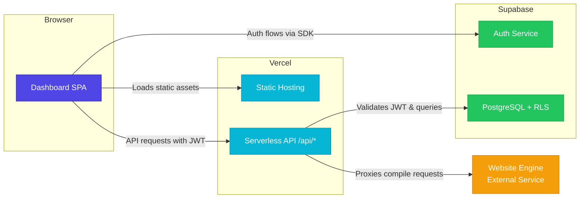
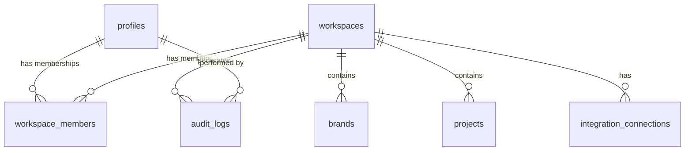
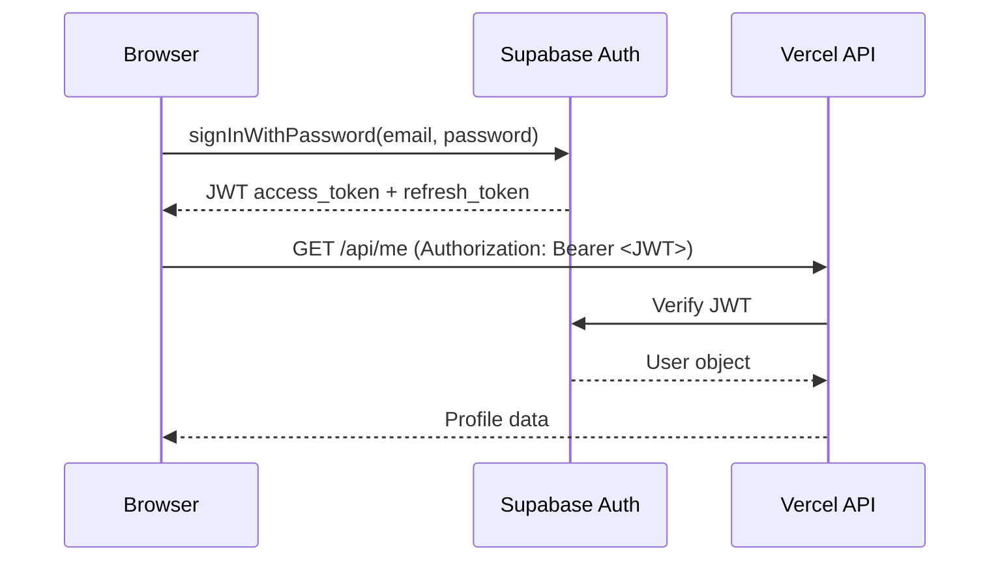

# System Architecture

> Multi-Tenant Agency Dashboard — Architecture Overview

---

## Overview

The dashboard is a **static Single-Page Application (SPA)** deployed on **Vercel**, backed by **Supabase** for authentication, database, and row-level security. The architecture follows a three-tier model:

| Layer        | Technology                          | Purpose                                  |
|--------------|-------------------------------------|------------------------------------------|
| **Frontend** | Vanilla HTML/CSS/JS                 | Dashboard UI, auth flows, module rendering |
| **API**      | Vercel Serverless Functions (Node.js) | Auth middleware, workspace validation, proxying |
| **Database** | Supabase PostgreSQL + RLS           | Data persistence, access control, audit logging |

---

## Architecture Diagram



---

## Frontend

### Technology

- **Vanilla HTML/CSS/JavaScript** — no build step, no framework
- **Supabase JS Client SDK** — loaded via CDN (`<script>` tag)
- Single `index.html` entry point with client-side routing

### Responsibilities

| Concern               | Implementation                                        |
|------------------------|-------------------------------------------------------|
| Authentication         | Supabase Auth SDK handles login, signup, password reset |
| Session Management     | `supabase-js` manages tokens, auto-refresh             |
| Workspace Selection    | Workspace picker stored in `localStorage`              |
| Module Rendering       | Dynamic DOM creation per selected module               |
| API Communication      | `fetch()` calls to `/api/*` with `Authorization` header |

### Key Patterns

```
┌─────────────────────────────────────────────┐
│                  index.html                  │
│                                              │
│  ┌──────────┐  ┌──────────┐  ┌───────────┐  │
│  │  Auth     │  │ Sidebar  │  │  Content   │  │
│  │  Screen   │  │  Nav     │  │  Area      │  │
│  └──────────┘  └──────────┘  └───────────┘  │
│                                              │
│  app.js  ←  All client logic                 │
│  styles.css  ←  All styling                  │
└─────────────────────────────────────────────┘
```

- No inline scripts in production (CSP-compatible)
- All user-facing text rendered via `textContent` or DOM APIs (XSS prevention)
- Auth state changes handled via `onAuthStateChange` listener

---

## API Layer

### Location

All serverless functions live under `/api/` in the project root.

### Route Map

| Route                          | Method   | Purpose                              |
|--------------------------------|----------|---------------------------------------|
| `/api/health`                  | `GET`    | Health check, returns `{ status: "ok" }` |
| `/api/me`                      | `GET`    | Returns authenticated user profile     |
| `/api/workspaces`              | `GET`    | Lists workspaces for current user      |
| `/api/projects`                | `GET`    | Lists projects in selected workspace   |
| `/api/website-engine/compile`  | `POST`   | Proxies compile request to engine      |

### Shared Utilities — `_utils.js`

All API routes import from `api/_utils.js`, which provides:

```javascript
// Authentication middleware
async function requireAuth(req)
// → Extracts JWT from Authorization header
// → Validates token with Supabase
// → Returns authenticated user object or throws 401

// Workspace validation
async function requireWorkspaceMembership(userId, workspaceId)
// → Checks workspace_members table
// → Returns member role or throws 403

// Audit logging
async function logAudit({ userId, workspaceId, action, resource, details })
// → Inserts into audit_logs table
// → Includes timestamp, IP, user agent

// Error response helper
function sendError(res, statusCode, message)
// → Consistent error response format
```

### Request Flow

```
1. Request hits Vercel edge
2. Routed to appropriate /api/ function
3. requireAuth() validates JWT
4. requireWorkspaceMembership() checks access
5. Business logic executes
6. Audit log written (for mutations)
7. Response returned
```

---

## Database

### Provider

**Supabase PostgreSQL** with Row Level Security (RLS) enabled on all tables.

### Schema Overview

#### Enums

```sql
-- Workspace roles
CREATE TYPE workspace_role AS ENUM ('owner', 'admin', 'editor', 'viewer');

-- Project types
CREATE TYPE project_type AS ENUM ('website', 'social', 'analytics', 'campaign');

-- Project status
CREATE TYPE project_status AS ENUM ('draft', 'active', 'paused', 'completed', 'archived');
```

#### Tables

| Table                      | Purpose                                | RLS |
|----------------------------|----------------------------------------|-----|
| `profiles`                 | User profile data (synced from auth)   | ✅  |
| `workspaces`               | Tenant workspaces                      | ✅  |
| `workspace_members`        | User ↔ Workspace membership + role     | ✅  |
| `brands`                   | Brand configurations per workspace     | ✅  |
| `projects`                 | Projects within workspaces             | ✅  |
| `integration_connections`  | Third-party integration credentials    | ✅  |
| `audit_logs`               | Immutable audit trail                  | ✅  |

#### Key Relationships



### RPC Functions

| Function                       | Purpose                                           |
|--------------------------------|---------------------------------------------------|
| `create_workspace_with_owner`  | Creates workspace + owner membership in a transaction |
| `get_user_role_in_workspace`   | Returns role for a user in a specific workspace    |

---

## Authentication

### Flow



### Details

- **Provider**: Supabase Auth (email/password)
- **Session Storage**: Managed by `supabase-js` client SDK in `localStorage`
- **Token Refresh**: Automatic via `supabase-js` `autoRefreshToken: true`
- **Server-Side Validation**: API functions extract JWT from `Authorization: Bearer` header, validate via Supabase Admin client
- **Password Reset**: Handled via Supabase email templates, redirects to `/password-reset` route

---

## Multi-Tenancy

### Model

**Workspace-based tenant isolation** — every piece of data belongs to a workspace, and users access workspaces through membership.

### Access Control Chain

```
User authenticates
  → workspace_members checked for user_id + workspace_id
    → Role determines permissions (owner > admin > editor > viewer)
      → RLS policies enforce at database level
        → API middleware double-checks at application level
```

### Workspace Isolation

- All database queries include `workspace_id` filter
- RLS policies use `auth.uid()` to check `workspace_members` table
- No cross-workspace data leakage is possible when RLS is enabled
- Users can belong to multiple workspaces with different roles

### Role Hierarchy

| Role     | Read | Create | Edit | Delete | Manage Members | Billing |
|----------|------|--------|------|--------|----------------|---------|
| `viewer` | ✅   | ❌     | ❌   | ❌     | ❌             | ❌      |
| `editor` | ✅   | ✅     | ✅   | ❌     | ❌             | ❌      |
| `admin`  | ✅   | ✅     | ✅   | ✅     | ✅             | ❌      |
| `owner`  | ✅   | ✅     | ✅   | ✅     | ✅             | ✅      |

---

## Website Engine Bridge

### Purpose

The Website Engine is an **external service** that compiles website templates into deployable assets. It is **never exposed directly to the browser**.

### Proxy Architecture

```
Browser → POST /api/website-engine/compile
           │
           ├─ Validate JWT
           ├─ Validate workspace membership
           ├─ Sanitize request payload
           ├─ Generate correlation ID
           │
           └─ POST → Website Engine (internal URL)
                       │
                       └─ Response proxied back to browser
```

### Security Measures

- Request payload validated and sanitized
- Timeout enforced on engine requests
- Path traversal patterns rejected
- Correlation IDs for request tracing
- Engine URL stored as server-side environment variable only

---

## Security Summary

| Layer     | Mechanism                                | Scope              |
|-----------|------------------------------------------|--------------------|
| Database  | Row Level Security (RLS) policies        | Every table        |
| API       | JWT validation + workspace membership    | Every endpoint     |
| Transport | HTTPS (enforced by Vercel)               | All traffic        |
| Headers   | CSP, X-Frame-Options via `vercel.json`   | All responses      |
| Secrets   | Service-role key server-side only         | Vercel env vars    |
| Proxy     | Engine requests never hit browser        | Website Engine     |

> **Defense in depth**: Even if one layer is bypassed, the other layers prevent unauthorized access. RLS at the database level is the final and most critical guard.

---

## File Structure

```
dashboard.kasimshah.com/
├── index.html              # SPA entry point
├── app.js                  # Client-side application logic
├── styles.css              # All styles
├── vercel.json             # Routing, headers, runtime config
├── .env.example            # Environment variable template
├── api/
│   ├── _utils.js           # Shared auth, validation, logging
│   ├── health.js           # GET /api/health
│   ├── me.js               # GET /api/me
│   ├── workspaces.js       # GET /api/workspaces
│   ├── projects.js         # GET /api/projects
│   └── website-engine/
│       └── compile.js      # POST /api/website-engine/compile
├── docs/
│   ├── ARCHITECTURE.md     # This document
│   ├── SUPABASE_SETUP.md   # Supabase configuration guide
│   ├── VERCEL_SETUP.md     # Vercel deployment guide
│   └── SECURITY.md         # Security design document
├── supabase_migrations.sql # Database schema & RLS policies
└── supabase/
    └── migrations/
        └── 20260714000000_platform_control_plane.sql  # Platform control plane migration
```

---

## Platform Control Plane

> Added by migration `20260714000000_platform_control_plane.sql`. See [PRODUCT_MODEL.md](file:///c:/Users/syedk/Documents/KS%20AGENT/projects/dashboard.kasimshah.com/docs/PRODUCT_MODEL.md), [PLATFORM_BOOTSTRAP.md](file:///c:/Users/syedk/Documents/KS%20AGENT/projects/dashboard.kasimshah.com/docs/PLATFORM_BOOTSTRAP.md), and [WORKSPACE_LIFECYCLE.md](file:///c:/Users/syedk/Documents/KS%20AGENT/projects/dashboard.kasimshah.com/docs/WORKSPACE_LIFECYCLE.md) for full details.

### Platform Users Table

The `platform_users` table stores agency staff with platform-level roles. It is separate from the `workspace_members` table used for customer authorization.

```sql
CREATE TYPE platform_role AS ENUM ('platform_owner', 'platform_admin', 'platform_support');

CREATE TABLE platform_users (
    user_id     UUID          PRIMARY KEY REFERENCES auth.users(id) ON DELETE CASCADE,
    role        platform_role NOT NULL,
    is_active   BOOLEAN       NOT NULL DEFAULT true,
    created_by  UUID          REFERENCES auth.users(id),
    created_at  TIMESTAMPTZ   NOT NULL DEFAULT now(),
    updated_at  TIMESTAMPTZ   NOT NULL DEFAULT now()
);
```

| Role               | Capabilities                                    |
|--------------------|------------------------------------------------|
| `platform_owner`   | Full control — provisions workspaces, manages platform users, archives |
| `platform_admin`   | Provisions and manages workspaces, cannot manage platform users |
| `platform_support` | Read-only view of own platform record and all workspaces |

RLS policies restrict visibility: owners see all, admins see active users, support sees only their own row. All mutations go through SECURITY DEFINER RPCs.

### Platform Role Helpers

Three SECURITY DEFINER helper functions are used in RLS policies and RPCs:

| Function                           | Returns          | Purpose                                          |
|------------------------------------|------------------|--------------------------------------------------|
| `is_platform_user()`              | `BOOLEAN`        | True if caller has any active platform role       |
| `get_platform_role()`             | `platform_role`  | Returns caller's platform role, or NULL           |
| `has_platform_role(platform_role[])` | `BOOLEAN`     | True if caller's role is in the allowed array     |

All three are `STABLE`, `SECURITY DEFINER`, and restricted to the `authenticated` Supabase role.

### Workspace Lifecycle

Workspaces follow a state machine: `provisioning` → `active` → `suspended` → `archived`, with `failed` as an error state. See [WORKSPACE_LIFECYCLE.md](file:///c:/Users/syedk/Documents/KS%20AGENT/projects/dashboard.kasimshah.com/docs/WORKSPACE_LIFECYCLE.md) for the full state diagram and transition rules.

```sql
CREATE TYPE workspace_status AS ENUM ('provisioning', 'active', 'suspended', 'archived', 'failed');
```

Lifecycle RPCs:

| RPC                                | Action                    | Required Role              |
|------------------------------------|---------------------------|----------------------------|
| `provision_customer_workspace()`   | Create new workspace      | `platform_owner`, `platform_admin` |
| `activate_workspace()`            | Activate workspace        | `platform_owner`, `platform_admin` |
| `suspend_workspace()`             | Suspend active workspace  | `platform_owner`, `platform_admin` |
| `archive_workspace()`             | Archive workspace (terminal) | `platform_owner` only   |
| `retry_workspace_provisioning()`  | Retry failed provisioning | `platform_owner`, `platform_admin` |

### Platform API Routes

The following API routes are planned for the platform control plane. These routes use `requirePlatformRole()` from `_utils.js` for authorization.

| Route                                  | Method  | Purpose                                  | Required Role              |
|----------------------------------------|---------|------------------------------------------|----------------------------|
| `/api/platform/workspaces`             | `GET`   | List all workspaces (platform view)      | Any platform role          |
| `/api/platform/workspaces`             | `POST`  | Provision a new customer workspace       | `platform_owner`, `platform_admin` |
| `/api/platform/workspaces/[id]`        | `GET`   | Get workspace detail + modules + members | Any platform role          |
| `/api/platform/workspaces/[id]`        | `PATCH` | Update workspace metadata/status         | `platform_owner`, `platform_admin` |
| `/api/platform/workspaces/[id]/activate`  | `POST` | Activate a workspace                  | `platform_owner`, `platform_admin` |
| `/api/platform/workspaces/[id]/suspend`   | `POST` | Suspend a workspace                   | `platform_owner`, `platform_admin` |
| `/api/platform/workspaces/[id]/archive`   | `POST` | Archive a workspace                   | `platform_owner` only      |
| `/api/platform/workspaces/[id]/modules`   | `PATCH` | Update workspace modules             | `platform_owner`, `platform_admin` |

### Separation of Platform vs Customer Authorization

The platform uses **two completely independent authorization domains**:

| Domain               | Table               | Middleware                   | Scope                        |
|----------------------|---------------------|------------------------------|------------------------------|
| **Platform**         | `platform_users`    | `requirePlatformRole()`      | Agency control centre ops    |
| **Customer**         | `workspace_members` | `requireWorkspaceMember()`   | Workspace-scoped data access |

A user may hold rows in both tables simultaneously. The two are never conflated — a platform role does not grant workspace-level data mutation rights, and a workspace role does not grant platform-level access.

### Module System

Each workspace has a set of enabled modules stored in `workspace_modules`:

```sql
CREATE TYPE workspace_module AS ENUM ('website', 'analytics', 'contacts', 'email', 'social', 'booking', 'crm');
```

Modules are provisioned at workspace creation and managed via `update_workspace_modules()`.

#### Production Connection Status

| Module       | Status                               |
|--------------|--------------------------------------|
| Website      | ✅ Connected — live via Website Engine |
| CRM          | ✅ Connected                          |
| Contacts     | ✅ Connected                          |
| Analytics    | ⚠️ **NOT YET PRODUCTION-CONNECTED**  |
| Email        | ⚠️ **NOT YET PRODUCTION-CONNECTED**  |
| Social       | ⚠️ **NOT YET PRODUCTION-CONNECTED**  |
| Booking      | ⚠️ **NOT YET PRODUCTION-CONNECTED**  |

> **Note:** Analytics, Email, Social publishing, and Booking modules exist in the schema and can be enabled on workspaces. However, they are **not yet connected to production backends**. Enabling them will show UI placeholders in the workspace sidebar but will not deliver live data or functionality until their respective integrations are implemented.
