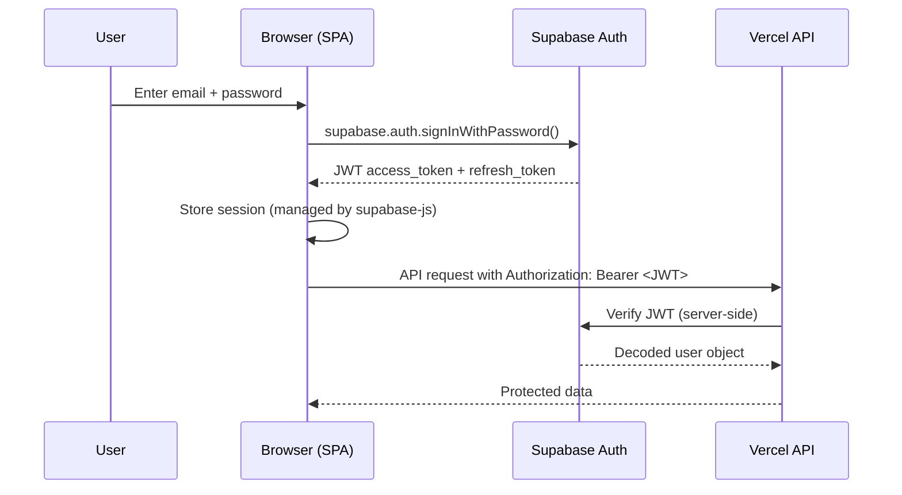

# Security Design Document

> Comprehensive security documentation for the multi-tenant agency dashboard.

---

## Table of Contents

- [Authentication](#authentication)
- [Authorization](#authorization)
- [Row Level Security (RLS)](#row-level-security-rls)
- [Credential Management](#credential-management)
- [Content Security Policy](#content-security-policy)
- [XSS Prevention](#xss-prevention)
- [Website Engine Proxy](#website-engine-proxy)
- [CORS Policy](#cors-policy)
- [Audit Logging](#audit-logging)
- [Rate Limiting](#rate-limiting)
- [Known Technical Debt](#known-technical-debt)

---

## Authentication

### Mechanism

Authentication is handled by **Supabase Auth** using email/password credentials.

### Flow



### Security Properties

| Property | Implementation |
|----------|---------------|
| **No unauthenticated access** | Dashboard redirects to login; API returns 401 |
| **JWT validation** | Every API call validates the JWT server-side |
| **Token refresh** | `supabase-js` handles automatic token refresh |
| **Password reset** | Via Supabase email flow; redirects to `/password-reset` |
| **Session storage** | `localStorage` managed by `supabase-js` SDK |

### API Authentication Middleware

Every API endpoint uses the shared `requireAuth()` function:

```javascript
// api/_utils.js
async function requireAuth(req) {
  const authHeader = req.headers.authorization;
  if (!authHeader || !authHeader.startsWith('Bearer ')) {
    throw { statusCode: 401, message: 'Missing or invalid authorization header' };
  }

  const token = authHeader.split(' ')[1];
  const { data: { user }, error } = await supabaseAdmin.auth.getUser(token);

  if (error || !user) {
    throw { statusCode: 401, message: 'Invalid or expired token' };
  }

  return user;
}
```

---

## Authorization

### Model

**Workspace membership + role-based access control (RBAC)**. Authorization is enforced at **both** the API layer and the database layer (defense in depth).

### Role Hierarchy

```
owner > admin > editor > viewer
```

| Permission        | viewer | editor | admin | owner |
|-------------------|--------|--------|-------|-------|
| Read data         | ✅     | ✅     | ✅    | ✅    |
| Create resources  | ❌     | ✅     | ✅    | ✅    |
| Edit resources    | ❌     | ✅     | ✅    | ✅    |
| Delete resources  | ❌     | ❌     | ✅    | ✅    |
| Manage members    | ❌     | ❌     | ✅    | ✅    |
| Workspace settings| ❌     | ❌     | ❌    | ✅    |
| Billing           | ❌     | ❌     | ❌    | ✅    |

### Enforcement Points

```
Request
  │
  ├─ API Layer: requireWorkspaceMembership()
  │   └─ Checks workspace_members table
  │   └─ Returns user's role
  │   └─ Rejects with 403 if not a member
  │
  └─ Database Layer: RLS Policies
      └─ auth.uid() checked against workspace_members
      └─ Role-based INSERT/UPDATE/DELETE restrictions
      └─ Impossible to bypass even with direct DB access
```

### API Authorization Middleware

```javascript
// api/_utils.js
async function requireWorkspaceMembership(userId, workspaceId) {
  const { data, error } = await supabaseAdmin
    .from('workspace_members')
    .select('role')
    .eq('user_id', userId)
    .eq('workspace_id', workspaceId)
    .single();

  if (error || !data) {
    throw { statusCode: 403, message: 'Not a member of this workspace' };
  }

  return data.role; // 'owner' | 'admin' | 'editor' | 'viewer'
}
```

---

## Row Level Security (RLS)

### Overview

**Every table** in the database has RLS enabled. RLS policies ensure that even if application-layer security is bypassed, the database itself prevents unauthorized access.

### Policy Design

Each table has separate policies for each operation:

| Operation | Policy Logic |
|-----------|-------------|
| **SELECT** | User must be a member of the resource's workspace |
| **INSERT** | User must be an `editor`, `admin`, or `owner` in the workspace |
| **UPDATE** | User must be an `editor`, `admin`, or `owner` in the workspace |
| **DELETE** | User must be an `admin` or `owner` in the workspace |

### SQL Helper Functions

```sql
-- Check if the current user is a member of a workspace
CREATE FUNCTION is_workspace_member(ws_id UUID)
RETURNS BOOLEAN AS $$
  SELECT EXISTS (
    SELECT 1 FROM workspace_members
    WHERE workspace_id = ws_id
    AND user_id = auth.uid()
  );
$$ LANGUAGE sql SECURITY DEFINER;

-- Get the current user's role in a workspace
CREATE FUNCTION get_user_role_in_workspace(ws_id UUID)
RETURNS workspace_role AS $$
  SELECT role FROM workspace_members
  WHERE workspace_id = ws_id
  AND user_id = auth.uid();
$$ LANGUAGE sql SECURITY DEFINER;
```

### Example RLS Policy

```sql
-- Projects: Users can only SELECT projects in their workspaces
CREATE POLICY "Users can view projects in their workspaces"
  ON projects FOR SELECT
  USING (is_workspace_member(workspace_id));

-- Projects: Only editors+ can INSERT
CREATE POLICY "Editors can create projects"
  ON projects FOR INSERT
  WITH CHECK (
    get_user_role_in_workspace(workspace_id) IN ('editor', 'admin', 'owner')
  );

-- Projects: Only admins+ can DELETE
CREATE POLICY "Admins can delete projects"
  ON projects FOR DELETE
  USING (
    get_user_role_in_workspace(workspace_id) IN ('admin', 'owner')
  );
```

### RLS Coverage

| Table | SELECT | INSERT | UPDATE | DELETE |
|-------|--------|--------|--------|--------|
| `profiles` | Own profile only | Auto-created | Own profile only | ❌ |
| `workspaces` | Member workspaces | Authenticated users | Owner only | Owner only |
| `workspace_members` | Same workspace members | Admin+ | Admin+ | Admin+ (can't remove owner) |
| `brands` | Member workspaces | Editor+ | Editor+ | Admin+ |
| `projects` | Member workspaces | Editor+ | Editor+ | Admin+ |
| `integration_connections` | Member workspaces | Admin+ | Admin+ | Admin+ |
| `audit_logs` | Member workspaces | System only | ❌ | ❌ |

---

## Credential Management

### Key Classification

| Credential | Exposure Level | Storage Location |
|-----------|---------------|-----------------|
| **Supabase Anon Key** | Public / Browser-safe | `index.html`, `.env` |
| **Supabase Service Role Key** | Secret / Server-only | Vercel environment variables |
| **Website Engine API Key** | Secret / Server-only | Vercel environment variables |
| **JWT Access Tokens** | Per-session / Browser | `localStorage` (managed by `supabase-js`) |

### Rules

1. **No service-role keys in the browser** — The anon key is safe because RLS restricts what it can access. The service role key bypasses RLS entirely and must never be exposed.

2. **No credentials in source code** — All secrets are loaded from environment variables. The `.env.example` file contains placeholder values only.

3. **`.env` excluded from git** — The `.gitignore` file must include `.env` to prevent accidental commits.

4. **Environment variable validation** — API functions validate that required environment variables are present at startup and fail fast if missing.

### What the Anon Key Can Do

```
With Anon Key + Valid JWT:
  ✅ Read data the user has access to (via RLS)
  ✅ Write data the user is allowed to (via RLS)
  ❌ Read other users' data
  ❌ Bypass RLS policies
  ❌ Access service-level operations

Without JWT (anonymous):
  ❌ Read any data (all tables require authentication via RLS)
  ❌ Write any data
  ✅ Sign up / Sign in (authentication endpoints only)
```

---

## Content Security Policy

### Current CSP Header

Configured in `vercel.json` and applied to all responses:

```
Content-Security-Policy:
  default-src 'self';
  script-src 'self' 'unsafe-inline' https://cdn.jsdelivr.net https://*.supabase.co;
  style-src 'self' 'unsafe-inline' https://fonts.googleapis.com https://cdnjs.cloudflare.com;
  font-src 'self' https://fonts.gstatic.com https://cdnjs.cloudflare.com;
  img-src 'self' data: https:;
  connect-src 'self' https://*.supabase.co;
```

### Allowed External Domains

| Domain | Purpose | Directive |
|--------|---------|-----------|
| `cdn.jsdelivr.net` | Chart.js, Supabase JS SDK | `script-src` |
| `*.supabase.co` | Supabase client SDK, Auth, API | `script-src`, `connect-src` |
| `fonts.googleapis.com` | Google Fonts stylesheets | `style-src` |
| `fonts.gstatic.com` | Google Fonts font files | `font-src` |
| `cdnjs.cloudflare.com` | Font Awesome icons | `style-src`, `font-src` |

### `unsafe-inline` — Technical Debt

> [!WARNING]
> The `script-src` and `style-src` directives currently include `'unsafe-inline'`. This weakens CSP protection and is tracked as technical debt.

**Why it exists**: Some existing inline scripts and styles require it for backwards compatibility.

**Removal plan**:
1. Extract all inline `<script>` blocks to external `.js` files
2. Extract all inline `<style>` blocks to external `.css` files
3. Remove inline `style=""` attributes, replacing with CSS classes
4. Remove `'unsafe-inline'` from CSP
5. If any inline scripts remain necessary, use CSP nonces (`'nonce-<random>'`)

---

## XSS Prevention

### Strategy

All user-facing text is rendered using **safe DOM APIs**. Raw HTML interpolation is avoided entirely.

### Patterns Used

```javascript
// ✅ SAFE: textContent (escapes HTML automatically)
element.textContent = userInput;

// ✅ SAFE: DOM creation
const el = document.createElement('div');
el.textContent = userInput;
container.appendChild(el);

// ✅ SAFE: setAttribute for safe attributes
element.setAttribute('data-id', userInput);

// ❌ FORBIDDEN: innerHTML with user data
element.innerHTML = `<div>${userInput}</div>`;  // NEVER DO THIS

// ❌ FORBIDDEN: String interpolation into HTML
const html = `<span>${userInput}</span>`;       // NEVER DO THIS
```

### Code Review Checklist

When reviewing code changes, verify:

- [ ] No `innerHTML` assignments with user-controlled data
- [ ] No template literal HTML construction with user data
- [ ] All user text rendered via `textContent` or `createTextNode`
- [ ] URL parameters validated before use
- [ ] No `eval()`, `Function()`, or `document.write()`

---

## Website Engine Proxy

### Architecture

The Website Engine is an external compilation service. All requests are **proxied through the Vercel serverless API** to prevent direct browser-to-engine communication.

```
Browser                     Vercel API                    Website Engine
  │                            │                              │
  ├─ POST /api/website-engine  │                              │
  │    /compile                │                              │
  │  + JWT token               │                              │
  │  + payload                 │                              │
  │                            ├─ Validate JWT                │
  │                            ├─ Validate workspace access   │
  │                            ├─ Sanitize payload            │
  │                            ├─ Generate correlation ID     │
  │                            ├─ POST engine URL ────────────┤
  │                            │  + API key                   │
  │                            │  + correlation ID            │
  │                            │                              │
  │                            │◄─── Engine response ─────────┤
  │                            ├─ Validate response           │
  │◄─── Proxied response ─────┤                              │
  │                            │                              │
```

### Security Measures

| Measure | Implementation |
|---------|---------------|
| **Authentication** | JWT required; workspace membership validated |
| **Request validation** | Payload structure validated before forwarding |
| **Timeout** | Engine requests have a configurable timeout (default: 30s) |
| **Path traversal prevention** | File paths in payloads checked for `../`, `..\\`, null bytes |
| **Correlation IDs** | UUID generated per request for end-to-end tracing |
| **URL isolation** | Engine URL stored as server-side env var; never exposed to browser |
| **Error sanitization** | Engine error details not forwarded raw to browser |

### Path Traversal Checks

```javascript
function validateFilePath(filePath) {
  const dangerous = ['../', '..\\', '\0', '%00', '%2e%2e'];
  for (const pattern of dangerous) {
    if (filePath.toLowerCase().includes(pattern)) {
      throw { statusCode: 400, message: 'Invalid file path' };
    }
  }
}
```

---

## CORS Policy

### Implementation

CORS is enforced at the API layer using the `APP_URL` environment variable.

```javascript
// api/_utils.js
function setCorsHeaders(res, req) {
  const allowedOrigin = process.env.APP_URL;
  const requestOrigin = req.headers.origin;

  if (requestOrigin === allowedOrigin) {
    res.setHeader('Access-Control-Allow-Origin', requestOrigin);
  }

  res.setHeader('Access-Control-Allow-Methods', 'GET, POST, PUT, DELETE, OPTIONS');
  res.setHeader('Access-Control-Allow-Headers', 'Content-Type, Authorization');
  res.setHeader('Access-Control-Max-Age', '86400');
}
```

### Origin Checking

| Environment | `APP_URL` Value | Allowed Origins |
|-------------|-----------------|-----------------|
| Production | `https://dashboard.kasimshah.com` | Exact match only |
| Preview | `https://<branch>.vercel.app` | Set per environment |
| Development | `http://localhost:3000` | Local dev only |

### Preflight Handling

All API endpoints handle `OPTIONS` requests for CORS preflight:

```javascript
if (req.method === 'OPTIONS') {
  setCorsHeaders(res, req);
  return res.status(204).end();
}
```

---

## Audit Logging

### What's Logged

All **privileged mutations** are logged to the `audit_logs` table:

| Event Type | Examples |
|------------|---------|
| **Workspace** | Create, update settings, delete |
| **Members** | Invite, role change, remove |
| **Projects** | Create, update, delete, status change |
| **Brands** | Create, update, delete |
| **Integrations** | Connect, disconnect, update credentials |
| **Compile** | Website engine compile requests |

### Log Schema

```sql
CREATE TABLE audit_logs (
  id UUID PRIMARY KEY DEFAULT gen_random_uuid(),
  workspace_id UUID REFERENCES workspaces(id),
  user_id UUID REFERENCES auth.users(id),
  action TEXT NOT NULL,          -- e.g., 'project.create', 'member.invite'
  resource_type TEXT,            -- e.g., 'project', 'workspace_member'
  resource_id UUID,              -- ID of the affected resource
  details JSONB,                 -- Additional context (old/new values, etc.)
  ip_address INET,               -- Request IP
  user_agent TEXT,                -- Browser/client info
  created_at TIMESTAMPTZ DEFAULT now()
);
```

### Logging Implementation

```javascript
// api/_utils.js
async function logAudit({ userId, workspaceId, action, resourceType, resourceId, details, req }) {
  await supabaseAdmin.from('audit_logs').insert({
    user_id: userId,
    workspace_id: workspaceId,
    action,
    resource_type: resourceType,
    resource_id: resourceId,
    details,
    ip_address: req.headers['x-forwarded-for'] || req.socket.remoteAddress,
    user_agent: req.headers['user-agent']
  });
}
```

### RLS on Audit Logs

- **SELECT**: Members can read their workspace's audit logs
- **INSERT**: Only server-side (service role key) can insert
- **UPDATE/DELETE**: Not allowed (immutable log)

---

## Rate Limiting

### Current Status

> [!IMPORTANT]
> Rate limiting is **not yet implemented**. This section documents the planned approach.

### Challenge

Vercel serverless functions are stateless — traditional in-memory rate limiting doesn't work because each invocation may run on a different container.

### Recommended Approach

Use a **serverless-compatible distributed store** for rate limit counters:

#### Option 1: Vercel KV (Recommended)

```javascript
import { kv } from '@vercel/kv';

async function rateLimit(identifier, limit = 100, windowMs = 60000) {
  const key = `ratelimit:${identifier}`;
  const current = await kv.incr(key);

  if (current === 1) {
    await kv.pexpire(key, windowMs);
  }

  if (current > limit) {
    throw { statusCode: 429, message: 'Too many requests' };
  }

  return { remaining: limit - current, limit };
}
```

#### Option 2: Upstash Redis

```javascript
import { Ratelimit } from '@upstash/ratelimit';
import { Redis } from '@upstash/redis';

const ratelimit = new Ratelimit({
  redis: Redis.fromEnv(),
  limiter: Ratelimit.slidingWindow(100, '1m'),
});

async function checkRateLimit(identifier) {
  const { success, remaining } = await ratelimit.limit(identifier);
  if (!success) {
    throw { statusCode: 429, message: 'Too many requests' };
  }
}
```

### Planned Rate Limits

| Endpoint | Limit | Window | Identifier |
|----------|-------|--------|-----------|
| `/api/health` | 60 | 1 minute | IP address |
| `/api/me` | 30 | 1 minute | User ID |
| `/api/workspaces` | 30 | 1 minute | User ID |
| `/api/projects` | 30 | 1 minute | User ID |
| `/api/website-engine/compile` | 10 | 1 minute | User ID + Workspace ID |
| Auth endpoints (via Supabase) | Managed by Supabase | — | — |

---

## Known Technical Debt

### 1. `unsafe-inline` in Content Security Policy

**Status**: ⚠️ Active — reduces CSP effectiveness

**Current state**: Both `script-src` and `style-src` include `'unsafe-inline'` to support existing inline scripts and styles.

**Risk**: An XSS vulnerability could execute inline scripts even with CSP enabled.

**Removal plan**:
1. Audit all inline `<script>` and `<style>` blocks
2. Extract to external `.js` and `.css` files
3. Replace inline `style=""` attributes with CSS classes
4. Implement CSP nonces for any remaining necessary inline scripts
5. Remove `'unsafe-inline'` from `vercel.json` CSP header
6. Test all functionality thoroughly after removal

**Priority**: Medium — current XSS prevention (no `innerHTML` with user data) mitigates the risk, but CSP should be the safety net.

---

### 2. Rate Limiting Not Implemented

**Status**: ⚠️ Not yet implemented

**Current state**: No rate limiting on any API endpoint. Vercel provides some DDoS protection at the edge, but application-level rate limiting is absent.

**Risk**: API abuse, credential stuffing (mitigated by Supabase Auth rate limits), resource exhaustion on the Website Engine.

**Implementation plan**:
1. Add Vercel KV or Upstash Redis to the project
2. Create rate limiting middleware in `_utils.js`
3. Apply per-endpoint limits (see [Rate Limiting](#rate-limiting) section)
4. Add `Retry-After` and `X-RateLimit-*` response headers
5. Monitor and tune limits based on production traffic

**Priority**: High — should be implemented before high-traffic production use.

---

### 3. Email Verification Not Enforced at API Layer

**Status**: ⚠️ Partial implementation

**Current state**: Supabase Auth supports email verification, but the API layer does not check `email_confirmed_at` before granting access.

**Risk**: Users with unverified emails can access the full dashboard and API.

**Implementation plan**:
1. Add email verification check to `requireAuth()`:
   ```javascript
   if (!user.email_confirmed_at) {
     throw { statusCode: 403, message: 'Email not verified' };
   }
   ```
2. Add a "verify your email" UI state in the dashboard
3. Add a resend verification email button
4. Decide on grace period (allow limited access for N hours?)

**Priority**: Medium — important for production but not a security-critical vulnerability since authentication still works correctly.

---

## Security Checklist

Use this checklist when reviewing the deployment:

- [ ] RLS enabled on all tables (verify with SQL query)
- [ ] `SUPABASE_SERVICE_ROLE_KEY` only in Vercel env vars, not in frontend
- [ ] `.env` file is in `.gitignore`
- [ ] CSP headers present on all responses
- [ ] No `innerHTML` with user-controlled data in `app.js`
- [ ] Website Engine URL not exposed in browser network requests
- [ ] CORS `APP_URL` set correctly for production
- [ ] Audit logging active for all mutation endpoints
- [ ] JWT validation active on all API endpoints
- [ ] Password reset flow tested end-to-end
- [ ] Preview environment uses separate credentials (if applicable)

---

## Related Documentation

- [ARCHITECTURE.md](./ARCHITECTURE.md) — System architecture overview
- [SUPABASE_SETUP.md](./SUPABASE_SETUP.md) — Database and auth configuration
- [VERCEL_SETUP.md](./VERCEL_SETUP.md) — Deployment and hosting setup
